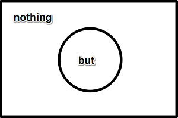
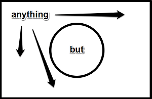

# but

辞書でbutをひくと、6つの〈品詞〉をもつ単語として掲載されている（『アンカーコズミカ』は〈動詞〉の意味を省略しており、5品詞）。

英語には〈品詞〉が8つしかないのに（10品詞説を唱える文法学者もいるが）、これでは、ほぼすべての〈品詞〉の意味を備えているということになり、非常にやっかいな存在であるように見える。

ここで〈品詞〉について、整理しておこう。英語には、次の8つの〈品詞〉がある：

1. 〈名詞〉（_n._）：主語や補語や目的語になる。
2. 〈代名詞〉（_pron._）：〈名詞〉の代わりをする。
3. 〈動詞〉（_v._）：主語を必要とし（命令文では省略）、〈自動詞〉（第1・2文型）と〈他動詞〉（第3・4・5文型）がある。
4. 〈形容詞〉（_a._）：〈名詞〉を修飾し、〈限定用法〉と〈叙述用法〉がある。
5. 〈副詞〉（_adv._）：〈動詞〉〈形容詞〉〈副詞〉〈文（節）〉を修飾する。
6. 〈前置詞〉（_prep._）：〈名詞〉を目的語にとる。
7. 〈接続詞〉（_conj._）：語と語、句と句、節と節を接続し、〈等位接続詞〉と〈従位接続詞〉がある。
8. 〈間投詞〉（_interj._）：単独で使われる。

我々も、この「英語には8種類の〈品詞〉がある」という8品詞説をとることにする。10品詞説は、〈助動詞〉と〈冠詞〉を独立の〈品詞〉としてカウントする傾向にある。8品詞説では、〈助動詞〉を「〈原形不定詞〉を後続させる特殊な〈動詞〉」として扱い、〈冠詞〉を〈限定用法〉の振る舞いをする〈形容詞〉の一種として扱う。

なお、日本語に〈品詞〉は10種類あるが、英語の8品詞のうち〈代名詞〉が〈名詞〉に含まれ、〈助動詞〉は独立して〈品詞〉になっており、〈前置詞〉は存在せず、英語になくて日本語にあるものとしては〈形容動詞〉〈連体詞〉〈助詞〉がある。〈間投詞〉は〈感動詞〉とよぶのがふつうである。この分類は、口語文法（現代日本語の文法）でも古語文法でも同じなので、ついでに覚えておくとよい。

さて、butは6つの〈品詞〉をもつとされる。ひとまずそれをリストしてみよう：

1. 〈接続詞〉：～だが、しかし
2. 〈前置詞〉：～を除いて、～以外には
3. 〈代名詞〉（関係代名詞）：（〈否定〉の語を〈先行詞〉として）～しないような…
4. 〈副詞〉：ほんの、ただ～だけ
5. 〈名詞〉：「しかし」ということば
6. 〈動詞〉：「しかし」と言う

多くの辞書には以上の6品詞が掲載されている（『アンカーコズミカ』では〈動詞〉が省略されている）が、もし、"Well"（ええと）だとか"Wow!"（ワオ！）だとかいった意味で"But"と口走る人がいたら（じっさい、いるだろう）、そのばあいは〈間投詞〉としてbutが機能している、と考えてよいだろう。

そうすると8品詞のうち7品詞もbutには備わっていることになる（もちろん〈形容詞〉としてbutを使いたいと思ったら、使えばよいのである。詩人やコピーライターであれば、すでにどこかで使っているかもしれない）。

なお、〈間投詞〉としてbut（でも、しかし）ばかり言っている人がいたら（日本人にも多いが）

- Not so many buts, please.（そんなに「しかし」ばかり言わないでください。）
- But me no buts.（「しかし、しかし」ばっかり言いなさんな。）

のようにたしなめることになるだろう。

いまの例文の1つめは、直訳すれば「そんなに多くの『しかし』という言葉はなしでお願いします。」となり、〈名詞〉として使われているので〈複数形〉のbutsになっている（ということは〈可算名詞〉だ）。

2つめは、直訳すれば「私に0個の『しかし』という言葉を言いなさい。（＝もう言うな）」となり、冒頭のButが〈他動詞〉（4文型動詞）で、直接目的語がやはり〈複数形〉の〈名詞〉である。

じつは**〈名詞〉と〈動詞〉のbutの説明は以上**である。学校の定期試験にはまず出ないだろうし、受験で出るとしても、文脈上、意味が明白な形で出てくるだろうから、もうこれ以上、butの〈名詞〉と〈動詞〉について学習する必要はない。

ただし、ことばというものは、このように、**使われ方によっていつでも振る舞いを変える**ものだ、ということは心に留めておいて欲しい。

たとえば、片手にリンゴを持って"This is apple."と述べたらおかしいのは当然だが（"This is an apple."と言わなければならない）、片手に"apple"という文字が書かれたプレートを持って"This is an apple."と述べたらこれもおかしい（"This is 'apple'."と言わなければならない）。後者は「これは『apple』ということばです。」という意味であり、butの〈名詞〉としての使い方は、これと同じである。

butのように、いくつもの〈品詞〉を同時に兼ね備える単語というものは、古くから使われている慣れ親しまれたものである。interpreter（通訳者）のように語尾をつけて派生させたような単語（つまり新しいことば）は、このように複数の〈品詞〉をもつことはない。

ひとつには、こういう古い単語は、〈品詞〉のことを細かく考えるよりも、バカになっていくつもの例文を暗記して、ただひたすら慣れる、というアプローチが有効である。我々日本人が日本語を話すときに、いちいち、品詞がこうだからここではこの単語を使うべきだ、などと考えなから話さないのと同じように、英語話者も「いつもこう言っているのだから、こう言うのが正しいのだ」と思って話している。

ただ、もうひとつには、とくにbutのばあいは、どの〈品詞〉で使われるのかによって〈文〉全体の意味が異なってくるという、致命的なポイントがある。この点に日本人（というか外国語としての英語の学習者）は注意すべきである。

表に簡潔にまとめてみると：

|品詞          |意味                |
|--------------|--------------------|
|接続詞《等位》|AだがB、AでもB      |
|接続詞《従位》|BしないA（ではない）|
|前置詞        |B以外でA、Bを除いてA|
|代名詞        |BしないところのA    |
|副詞          |たんなるB           |

こうなる。

これは厄介である。たんに

- A but B

というときに、〈等位接続詞〉〈副詞〉のばあいは「Bである」という主張が強調されるのに対して、〈従位接続詞〉〈前置詞〉〈代名詞〉のばあいは「Bではない」という主張が強調される。

butにややこしさがあるとすれば、ここがポイントなのだが、ここをみるためにも、ひとつひとつの〈品詞〉をみていこう。

## 〈接続詞〉but
おそらく、ほとんどの日本人がbutという英単語を学習するのは、〈接続詞〉としてのbut、つまり「でも」「しかし」という意味のbutだろう。

じつをいうと、もともとは〈前置詞〉のbutが先にあって、そこから派生するかたちで〈接続詞〉としてのbutが生まれた。だからほんらいであれば、〈前置詞〉の用法を先に説明するのが筋なのだが、中学英語以来ずっと〈接続詞〉としてのbutを目にしてきただろうから、それを整理する意味でも、ここでは〈接続詞〉butを先にやっつけてしまおう。

ポイント：**〈接続詞〉には〈等位接続詞〉と〈従位接続詞〉がある**。

butにはどちらの用法もある。ここでは順番にみていこう。

### 〈等位接続詞〉but
ポイント：**〈等位接続詞〉butの意味：A but B「AしかしBだ」「AとはいえBだ」**（要するにBだ）。

〈等位接続詞〉は、文字通り、語と語、句と句、節と節を**文法上対等な関係のものとして結びつける働きをする**ことばである。

「文法上対等な」ということばを理解するために、次の例文をみよう：

- I like baseball _and_ soccer.（ぼくは野球とサッカーが好きだ。）《語の接続》
- Which do you like watching movies _or_ reading books?（映画鑑賞と読書とどっちが好き？）《句の接続》
- She is cute, _but_ I don't like her.（彼女はかわいらしいが、ぼくは好きではない。）《節の接続》

and, or, butという基本的な〈接続詞〉を使った3つの例文だが、いずれも、〈接続詞〉の前と後が、対等な関係にある。これはあくまでも「文法上対等な」関係であって、**「意味的に対等」ということではない**。たとえば：

- I like playing baseball, _but_ don't like playing soccor.（ぼくは野球をするのは好きだがサッカーをするのは好きではない。）

のbutの前後は、文法的には対等だが、意味的には「対立」の関係にある（「好き」と「好きではない」は、ふつう、対立していると考えられる）。

じつは、この**「意味的には対立」**ということが、butという〈接続詞〉の特徴である。

つまり**A but B**というとき、AとBは対立関係にあるのでなければならないし、対立関係にあるのでなければbutを使うことはできない。

これは日本語の「～だが」「～が」というときの感覚と大きく異なるため、注意が必要だ。

たとえば日本語で「彼女の名前はアン**だが**、彼女の飼っている猫の名前はタマである。」というとき、「だが」ということばから反射的にbutに翻訳したくなってしまうが、「彼女の名前はアン」ということと「彼女の飼っている猫の名前はタマは」だということは意味的に対立していない。したがって、これは：

- Her name is Ann, _and_ her cat's name is Tama.

とandで接続しなければならない。

先の例文：

- She is cute, _but_ I don't like her.

でbutが使われているのは、「誰かをかわいらしいと判断するのであれば、たいてい、その誰かを好ましく思うだろう」という共有された前提があるからだ。「彼女はかわいい。**にもかかわらず**私は彼女を好きではない。」というわけである。

逆の観点からいえば、「英語の読解では、文脈を読むことが大切である」と一般にいうときに、**「文脈」はこのbutに潜んでいる**ことになる。長文を読解していて、butが使われていたら、そこに筆者が依拠している「文脈」を読み取るヒントがあると思っていいだろう。

〈等位接続詞〉としてのbutの使い方は、以上ですべてである。

ここから「大学受験用に必要なポイント」を演繹していこう。

まず：

- A but B

というとき、AとBは対立している。ということは、Aを否定して：

- not A but B

というときは、Bを肯定していることになる。

なお、この形が主語になっているばあい：

- Not I _but_ you _are_ about to leave.（出発しようとしているのは私でなくあなただよ。）

のように、〈動詞〉はBに一致させる。次との違いに注意：

- She _and_ he _are_ about to leave.（あなたと私は出発しようとしているところだ。）

andのときは、〈動詞〉はA and B全体に一致させる。

次に、not A but Bということばの並びから容易に連想されるように：

- not only A but also B

というイディオムを作ることができる。

このばあい、否定しているのはAではなくonlyであるから、「A**のみ**というわけではなく、B**もまた**」という意味になる。

- She is _not only_ clever _but also_ beautiful.（彼女は賢いだけでなく、美人でもある。）

中学英語以来、not only A but also Bのかたちばかり目にしてきたかもしれないが、butよりも前の部分ですでにonlyを否定しているので、このalsoは省略することができる。

- She is _not only_ clever _but_ beautiful.

長文読解などでは、こちらのかたちのほうがふつうかもしれない。

なお、試験で問われるとすれば、いまさらnot only A but Bのかたちをそのまま問うような問題は出ない。「言い換え」が出る。これは次のように言い換えられる：

- She is beautiful _as well as_ clever.（B as well as A）
- She is _both_ clever _and_ beautiful.（both A and B）
- She is _at once_ clever _and_ beautiful.（at once A and B）
- _Besides_ being clever, she is beautiful.（besides A, B）

もちろんそれぞれ、使用状況によって微妙にニュアンスは異なるが、試験で問われるのは論理的に等価であるか否か、という点なので、細かいことは気にせずに、バカになって丸暗記しよう。

### 〈従位接続詞〉but
ポイント：**〈従位接続詞〉butの意味：never A but B「BせずにAすることは決してない（AするとかならずBする）」not A but B「BしないようなAではない」**（たいていAに否定の意味がきて、〈二重否定〉をつくる）。

〈従位接続詞〉は、主節に対して従属節を関連づける働きをする語である。

- I thought _that_ it would rain.（私は雨になるだろうと思った。）

主節がI thoughtでSV、thatが〈名詞節〉を導く〈接続詞〉で、that以降が従属節になっている。〈名詞節〉であるから、これは〈他動詞〉の目的語になることができる（目的語になるのは〈名詞〉のみである）。that以降はit would rainがSVだが、主節に対して従属節のなかの主語と動詞であることを明示するため、S'V'などと表記したりする。

もうひとつ例文をみよう：

- _Though_ I thought that it would rain, it was fine.（私は雨になるだろうと思ったが、晴れた。）

今度は「譲歩」の意味の〈接続詞〉Thoughが、〈副詞節〉を導いている。主節はit was fineでSVCとなっており、この主節全体を〈副詞節〉が修飾している。なお、学校英語の世界で「譲歩」というときには、ふつうの日本語でいう「譲歩」（自分の主張を引っ込めること、妥協すること）の意味は一切ないことに注意しておこう（「私はこう思うの**だが**、君の言うとおりにしてみよう。」というときの「だが」が共通している、というだけである）。

〈名詞節〉〈副詞節〉ときたら次は〈形容詞節〉なのか、というと、〈形容詞節〉は〈関係詞〉が導く〈関係詞節〉がつくることになっている（他にも、よく〈関係代名詞〉thatの「省略」と学校では説明される〈接触節〉も〈形容詞節〉だ）。

ということは、〈従位接続詞〉は〈名詞節〉か〈副詞節〉を導く、ということになる。

butを〈従位接続詞〉として使うばあいも〈名詞節〉か〈副詞節〉になるのだが、大学受験までは、圧倒的に〈副詞節〉の表現のほうを目にすることが多い。

たとえば：

- I _never_ think of it _but_ I think of my childfood.（私は、子ども時代のことを考えることなしに、そのことを考えることは決してない。＝そのことを考えると、私は必ず子ども時代のことを思い出す。）

このbut節＝〈副詞節〉は**〈否定〉の意味を含んでいる**ことに注意しよう。たとえばこの文はwithout doingで言い換えることができる：

- I _never_ think of it _without thinking_ of my childfood.

こうしてみるとわかるように、S never V but S' V'は、「Sは、S'V'すること**なしに**、Vすることは決して**ない**。」という〈二重否定〉になっている。つまり「SがVすると、必ずS'がV'する。」という意味になる。

いまのwithout doingで言い換えられる〈従位接続詞〉butの他に、もうひとつ、〈副詞節〉を導く使い方がある。

- He is _not such_ a fool _but_ he can see the reason.（彼はその理由がわからないほどバカではない。）

このばあいでも、先と同様、but節は**〈否定〉の意味を含んでいる**。ただしこちらはthat...notで言い換えられる：

- He is _not such_ a fool _that_ he can_not_ see the reason.

なお、いまのは「～しないほどバカではない」の決まり文句だが、「～するほどバカではない」を意味する決まり文句として、入試にもっともよく出る表現が：

- He _knows better than to do_ such a thing.（彼はそんなことをするほどバカではない。）

である。これも言い換え問題が頻出である：

- He is _too wise to do_ such a thing.
- He is _wise enough not to do_ such a thing.

後者のenough toを使った表現は、notを使うことで「～しないには十分～」という意味を表しているのだから、これはnotをはずして、次の言い方ができる：

- He is _wise enough to see_ the reason.（彼はその理由がわからないほどバカではない。）

これらの「しないほどバカじゃない」「するほどバカじゃない」系の表現は、〈否定〉を媒介にしてぐるりと一周し、等価な表現に戻ってくる。まとめて覚えておこう。

### but for〈仮定法〉
ポイント：**but forの意味：～がなければ；～がなかったなら**（〈仮定法過去〉にも〈仮定法過去完了〉にも使える）。

文法テキストの「仮定法」の単元には必ず書いてあるbut forという表現も、いちおう、〈従位接続詞〉のbutを使っている。しかしこれはあまりにも有名なので、〈接続詞〉がどうのこうのと、細かいことは意識しなくてよい。

次のすべての表現は同じ意味である：

- If there _were_ no water, we _could_ not live.（もし水がなかったら、我々は生きることができない。）
- If it _were not for_ water, we _could_ not live.
- _Were it not for_ water, we _could_ not live.《倒置表現》
- _But for_ water, we _could_ not live.
- _Without_ water, we _could_ not live.

これはいわゆる〈仮定法過去〉である。かんたんに〈仮定法〉を復習しておくと、

1. 現実に反する仮定（古文でもおなじみの〈反実仮想〉）であるなら、〈仮定法〉になる。
2. 「現在の事実」に反する〈反実仮想〉であるなら、〈仮定法過去〉になり、「過去の事実」に反する〈反実仮想〉であるなら、〈仮定法過去完了〉になる。
3. 〈仮定法過去〉は**If S' + 動詞の過去形（be動詞はwere）, S + ｛would, could, should, might｝ + 原形不定詞**となる。
4. 〈仮定法過去完了〉は**If S' + 動詞の過去完了形, S + ｛would, could, should, might｝ + 完了不定詞**となる。

先の例文は、「もし水がなかったら」と「現在の事実」に反する仮定をしているので、〈仮定法過去〉が使われている（現実には、いま現在、水はあり、我々は生きているのだから）。

次のすべての表現も同じ意味である：

- If you _had not helped_ him, he _would have failed_ in the examination.（もしあなたの手助けがなかったなら、彼はその試験に失敗していただろう。）
- If it _had not been for_ your help, he _would have failed_ in the examination.
- _Had it not been for_ your help, he would have failed in the examination.《倒置表現》
- _But for_ your help, he _would have failed_ in the examination.
- _Without_ your help, he _would have failed_ in the examination.

これは「もしあなたの手助けがなかったなら」と「過去の事実」に反する仮定をしているので、〈仮定法過去完了〉が使われている（現実には、過去において、「あなた」は「彼」を助けて、彼は試験に成功したのだから）。

〈仮定法〉はもっとややこしいのだが（条件節と帰結節で時制が異なるケースが試験に出る）、それは文法の学習で補って欲しい。

But forやWithoutで書き換えると、いずれも条件節の時制が消えてしまうので、こんなに楽なことはないのだが、じっさいにはテストでは、If節を使った表現のほうへの書き換え問題が出るため、時制に注意したい。

## 〈前置詞〉but
ポイント：**〈前置詞〉butの意味「～の他は」「～を除いて」**（＝except）。

exceptのほうが「除外」の意味が強いが、いずれにせよ、butの後ろは〈否定〉の意味になる（この点で〈従位接続詞〉butと同様である）。

例文をみよう：

- Everyone _but_ you _was_ tired.（あなた以外のみんなが疲れていた。）

このbutは〈前置詞〉だから、but youが〈形容詞句〉になっていて、Everyoneを修飾している。当然、主語はEveryoneであるから、〈動詞〉はEveryoneに一致させる。

基本的には、〈前置詞〉butの説明は以上で終わりである。つまりA but Bとなっていたら、「B以外のA」「Bを除いたA」「BではないところのA」という意味になる。

この基本的な意味から、「大学受験用に必要なポイント」を演繹していこう。

まず、

- She thinks of _nothing but_ making money.（彼女は金もうけのことしか考えていない。）

nothingとは、見た通り、no＋thingの合成語である。noとは「ゼロの」「無の」という〈形容詞〉である。だからnothingは「ゼロのモノゴト」「無であるところのモノゴト」という意味になり、「何もない」ことを意味している。

上の例では、「金もうけのことを除いて」の部分がbut句＝〈前置詞句〉＝〈形容詞句〉であり、nothingを修飾している。ということは、「彼女は金もうけのこと以外では、考えていることはゼロである。」と直訳できる。ようするに「彼女は金もうけのことだけ、考えている。」ということだ。

「しか」「だけ」を意味するonlyで言い換えられるから、

- She thinks of _only_ making money.

と同じ意味になる。もう一例：

- He is _nothing but_ a child.（彼はたんなる子どもにすぎない。）

これも、「子どもであるということを除いて」が、この文の補語であるnothingを修飾していて、「彼は子どもであるということを除けば、無に等しい。」と直訳できる。ようするに「彼は子ども以外の何者でもない。＝彼はたんに子どもというだけである。」ということだ。

似たようなイディオムが他にもある。

- This is _anything but_ easy.（これは易しいなんてもんじゃない。）

anythingは、any＋thingの合成語だ。肯定文でanyを使うときは「どんなモノ・ヒト・コトでも」という意味になり、Anything will do.といえば「なんでもいいので（ください）。」という意味になる。

今の例では、「易しいということ以外の」と部分が〈形容詞句〉になっており、anythingを修飾している。ということは、「これは、易しいということ以外のなにごとかである。」と直訳できる。ようするに「これを易しいと言うのでなければ、何とよんでもいいよ。＝これが易しいなんて、とんでもない。」ということだ。

「～どころではない」「～からはかけ離れている」を意味する_far from_で言い換えられるから、

- This is _far from_ easy.

と同じ意味になる。

なお、anything butを否定文で使えば、これはnothing butと同じ意味になる：

- She does_n't_ think of _anything but_ making money.（彼女は金もうけ以外のことは何も考えていない。）

これは否定文においてよく使われるanythingの意味そのままだから、わかりやすい。

nothing but, anything butときたら、次はall butだ：

1. _All but_ she answered the question.（彼女を除いてみんなその質問に答えた。）
2. It is _all but_ impossible.（それはほとんど不可能だ。）

これは、2つの文で、機能（ことばの働き方）に違いがあることに注意しよう。

1つめは、「彼女以外の」という〈形容詞節〉が「みんな」を修飾しており、結果としてAll but sheという〈名詞句〉が主語になっている（主語になるのは〈名詞〉だけである）。この使い方は、〈前置詞〉butの素直な使い方で、わかりやすい。

2つめがわかりにくい。「不可能であるということを除いて、すべてだ」と解釈すると、「可能だ」と強調していることになってしまう。この文が主張していることは**「不可能だとまでは言わないが、ギリギリ不可能に近い程度にしか可能ではない」**ということである。ようするに「ほとんど不可能」ということになる。

どうしてこういう意味になるのかを理解するには、この意味でのall butの言い換え表現であるalmost≒nearlyを理解しなければならない。

almostのややこしさについては別の項目で解説するが、ここでかんたんにおさらいしておこう。

almostを「ほとんど」と訳してしまうと、日本語と英語で逆の意味になってしまう：

- He was throwing darts and _almost_ hit the center.（彼はダーツをしていたが、もう少しで中心に当たりそうだった。）

これはつまり、almostということで、「もう少しのところで到達しなかった」ことを意味している。つまり彼の投げたダーツは、ひとつも中心には当たっていないのである。

これを「ほとんど」と訳してしまうと「彼はダーツをしていたが、ほとんど中心に当たった。」となって、「いくつかは外れたものの、ほとんどのダーツが中心に当たった」ことを意味し、まったく逆の意味になる。

almostとnearlyを「ニアリー・イコール」で並べたのは、論理的には等価でも、意味的に異なる状況で使われることが多いからだ。almostが「もう少しのところで到達していない」こと意味するのに対し、nearlyは「もう少しで到達しそう」な状態を意味する。したがって：

1. She _almost_ drowned.
2. She _nearly_ drowned.

では、almostということで「危なかったが、結局彼女は溺死しなかった。」ことを強調し、nearlyでは「危うく溺死しかけた。」ことを強調することになる。

ここでall butに戻るのだが、これまでに出てきたnothing butやanything butとともに、考え方を図解してみよう。

まずnothing but：

butという〈前置詞〉は、中央のサークルを示している。nothing butとは、「このサークルを除けば、何もない」ことを意味しており、「このサークルの中でしかない（only）」が論理的に導かれる。

次にanything but：

anything butのばあいは、「このサークルを除きさえすれば、どれでもよい」ことを意味しており、「このサークルの中であることなど、決してない（far from）」が論理的に導かれる。

つぎにall but：

all butは「このサークル以外のすべて」と解釈してはまずい。「サークル以外のすべて」を論理的に導出したあとで、サークルの外側につくられる**境界線**のことを意味している。これはちょっと苦しい図解かもしれないが、「allなんだけど、ギリギリ、butの内部には到達していない」という状態をイメージして欲しい。

だから：

- It is _all but_ impossible.

というとき、「可能なんだけど、ギリギリ、不可能にはなっていない（という程度に可能というだけであって、ほぼ不可能と言ったほうがよいぐらいである）」という意味になる。これは：

- It is _almost_ impossible.

と同じ意味である。

ここまで、nothing but, anything but, all butと見てきたが、もっともよく目にするのがnothing butという表現ではないかと思う。

butは面白いことに、〈to不定詞〉のtoのように、〈原形不定詞〉を取ることができる（〈to不定詞〉も取る）。

- The old man has _nothing to do but watch_ TV.（その老人はテレビを見る以外することがない。）

直訳すれば「その老人にはやるべきことがない、テレビを見ること以外には。」となる。このかたちでは、butは〈原形不定詞〉を取る。

- She did _nothing but complain_.（彼女は不平ばかり言っていた。）

直訳すれば「彼女は何もしなかった、不平を言うこと以外は。」となり、

- All she did was (to) complain.

と同じ意味になる。これはnothing butのかたちだから、もちろん：

- She did _only_ complain.

と言い換えられる。

- We _have no choice but to go_.（我々には、行くより他に選択の余地がない。）

このhave no choice but to doというかたちは決まったフレーズだから、toを省略できない。

- I _cannot but laugh_.（笑わざるをえない。）

これは少し堅い、文語調の言い方である。

- I _cannot help but laugh_.

と言うこともできるが、もっと一般的な言い方は：

- I _cannot help laughing_.

である。肯定文だと：

- I _can but hope_ that everything goes well.（すべてが順調にいくことを願うしかない。）

という言い方があるが、これも：

- I _can only hope_ that everything goes well.

というほうが一般的である。

〈前置詞〉butの決まった言い回しの最後は（最後といっても、日本の高校生にとっては、ということでしかないが）：

- He lives _next_ door _but one_.（彼は1軒おいて隣に住んでいる。）
- Read _the last_ line _but one_.（下から2行目を読みなさい。）
- She is _the oldest_ Japanese _but one_.（彼女は2番めに高齢の日本人です。）

first, last, nextなどとともに使うことで、「ひとつ飛ばして」「ひとつを除いて」の意味になる。これは〈前置詞〉butのもっとも素直な使い方のひとつだ。

## 〈代名詞〉but
このbutは〈関係代名詞〉である。

ポイント：**〈関係代名詞〉butの意味：（否定の語を先行詞に取って）「～しないところの」**。

これはかなり古い表現であって、日常会話で使うような表現ではない。しかし、日本語もそうであるが、古くからある決まり文句・ことわざなどは、わざと古めかしい表現を使うことで、効果を発揮するともいえるし、なにより、入試にはいまだに出題される：

- There is _no_ rule _but_ has some exceptions.（例外のない規則はない。）

〈先行詞〉はruleで、but以下は〈否定〉の意味を持っている。したがって「例外を持たないような、そういうゼロ個の規則がある。」という意味になる。ようするに「例外を持たない規則はない。」ということだ。

〈代名詞〉butで出題されるのは、この形だけだろう。

## 〈副詞〉but
最後に、〈副詞〉のbut。

ポイント：**〈副詞〉butの意味：「だけ」「のみ」**（＝only）。

- He is _but_ a child.（彼はほんの子どもにすぎない。）

これは当然：

- He is _only_ a child.

と言い換えられるから、

- He is _nothing but_ a child.

と同じ意味である。
